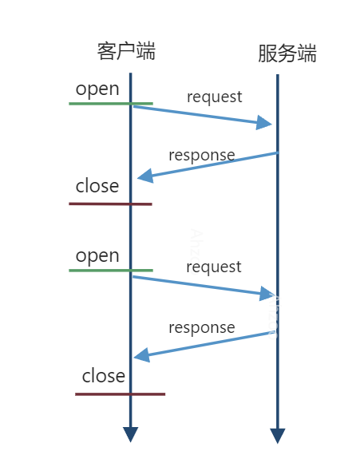
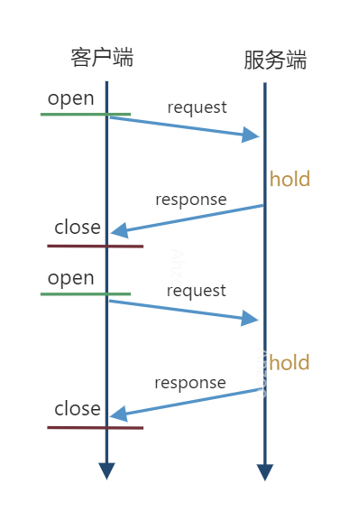
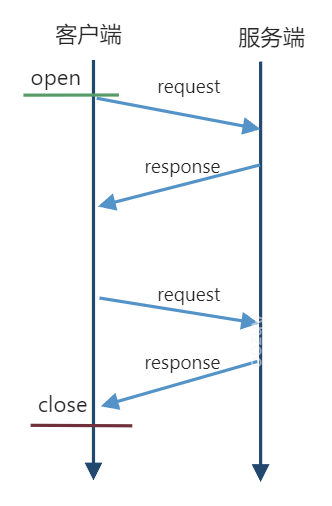
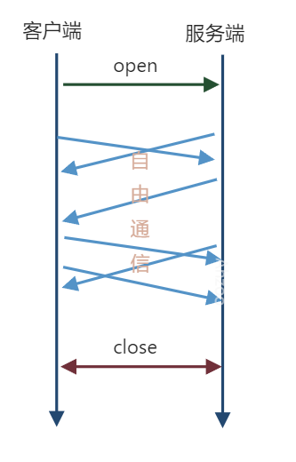
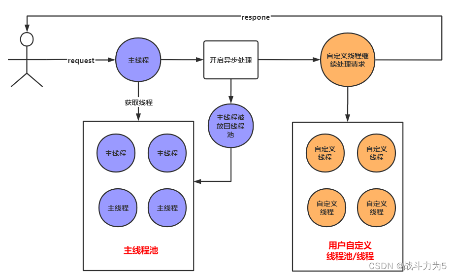

## 前言

实现即时通讯常见的有四种方式，分别是：轮询、长轮询(comet)、长连接(SSE)、WebSocket。

## 介绍

### 轮询

拉模式，不管服务端数据有无更新，客户端利用Ajex定时发送请求拉取一次数据，可能有更新数据返回，也可能什么都没有。
**优点**: 后端编码简单
**缺点**: 数据延迟、消耗资源过大、请求次数太多

### 长轮询(comet)

客户端发起长轮询，如果服务端的数据没有发生变更，会hold住请求，直到服务端的数据发生变化，或者等待一定时间超时才会返回。返回后，客户端再发起下一次长轮询请求监听。
**优点**:

- 相较于轮询基本不存在消息延迟，请求次数降低很多
- 长轮询是在 XMLHttpRequest 之后实现的，它几乎得到了设备的普遍支持，因此通常很少需要有进一步的备选方案，在很多场景下，可以作为即时通信的最简单实现方案和兜底兼容方案。

**缺点**:服务器一直保持连接会消耗资源，需要同时维护多个线程，而服务器所能承载的 TCP 连接是有上限的，所以这种轮询很容易导致连接上限。

### 长连接(SSE)

客户端和服务端建立连接后不进行断开，之后客户端再次访问这个服务端上的内容时，继续使用这一条连接通道
**优点**: 消息即时到达，不发无用请求
**缺点**: 与长轮询一样，服务器一直保持连接是会消耗资源的，如果有大量的长连接的话，对于服务器的消耗是巨大的，而且服务器承受能力是有上限的，不可能维持无限个长连接。

### WebSocket

客户端向服务器发送一个携带特殊信息的请求头（Upgrade:WebSocket ）建立连接，建立连接后双方即可实现自由的实时双向通信。
**优点**:

- 较少的控制开销。在连接创建后，服务器和客户端之间交换数据时，用于协议控制的数据包头部相对较小。
- 更强的实时性。由于协议是全双工的，所以服务器可以随时主动给客户端下发数据。相对于HTTP请求需要等待客户端发起请求服务端才能响应，延迟明显更少；即使是和Comet等类似的长轮询比较，其也能在短时间内更多次地传递数据。
- 保持连接状态。与HTTP不同的是，Websocket需要先创建连接，这就使得其成为一种有状态的协议，之后通信时可以省略部分状态信息。而HTTP请求可能需要在每个请求都携带状态信息（如身份认证等）。

**缺点**: 相对来说，开发成本和难度更高。例如，当连接终止时，WebSockets 无法自动恢复连接。

## 长轮询

长轮询挂起请求，等待新数据更新后再响应的处理方式虽然能减少浏览器的请求次数，并带来即时性，但是如果使用同步处理请求的方式，挂起请求则代表了线程的阻塞，有多少长轮询请求未响应就代表要阻塞多少个Servlet线程。所以长轮询必须使用异步处理方式。

流程:

- 请求发送到服务器。
- 服务器在有新数据之前不会响应请求。
- 当新数据出现、或超过预设等待时间时，服务器将对其请求作出响应。
- 浏览器立即发出一个新的请求。

如上图，在主线程中开启异步处理，主线程将请求交给其他线程去处理，主线程就结束了，被放回了主线程池，由其他线程继续处理请求，可以避免主线程池线程耗尽，起到容器线池程和工作线程池隔离的效果。

## 案例描述

用户在网页使用微信扫码登陆，使用手机app扫码后微信服务器向后端服务器回调扫码事件，由于前端无法感知到用户手机扫码的行为，所以停留在扫码登陆页面时需要持续轮询后端服务器用户是否已扫码登录，造成服务器的较大压力，于是利用Servlet3.0的异步特性，实现长轮询的方式来通信。

前端的扫码登录页面向后端请求微信登录二维码，后端返回微信登录二维码给前端时附带随机生成的scene_id，前端显示二维码供用户手机微信扫码，前端持续轮询后端用户是否已扫码（上一次轮询未成功登陆为开启下一次轮询的条件），但需带上scene_id以区分扫码用户，此时后端不同步返回前端请求结果，而是以异步响应式的方式等待微信服务器回调后，或是超过指定时间例如30秒后再返回（可能用户打开登陆页面后停留但未成功扫码），大大减少了前端访问后端的次数。

编辑时间