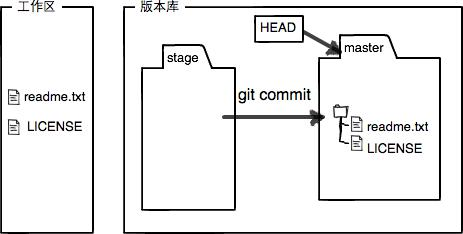

## Git分布式版本控制工具

### Git简介

Git是用C语言开发的分布式版本控制系统，所谓版本控制系统，就是可以储存一个文件在不同时间的版本，记录每次文件的改动，可以根据需要，随时切换到之前的版本(比如在编写Word文档的过程中，能记录下你每一次保存下来的记录，如果你对于现在的修改不满意，就可以回退到之前保存的版本)。
为什么Git比其他版本控制系统设计得优秀，因为Git跟踪并管理的是修改，而非文件。

### Git安装

Linux安装

```shell
sudo apt-get install git
```

Windows通过Git官网下载

```shell
配置全局用户名和邮箱
git config --global user.name "Your Name"
git config --global user.email "email@example.com"
```

```shell
配置当前仓库用户名和邮箱
git config user.name "gitlab’s Name" 
git config user.email "gitlab@xx.com"
```

```shell
git config --list   # 查看配置列表
```

### 创建版本库

```shell
mkdir learngit      # 创建文件夹
cd learngit         # 切换到新建的文件夹
git init            # 创建一个空的Git仓库或重新初始化已有仓库
```

Git只能跟踪文本文件的改动，比如TXT文件、网页、程序代码等等。关于二进制文件，可以由Git进行管理，但是无法跟踪文件的变化。

### Git简单使用

添加文件到Git仓库，分两步：

使用命令 `git add <file>`添加内容到索引，注意，可反复多次使用，添加多个文件；
使用命令 `git commit -m <message >`记录仓库的修改。
要随时掌握工作区的状态，使用`git status`命令。
如果`git status`告诉你有文件被修改过，用`git diff`可以查看修改内容。

### 工作区和暂存区

工作区(Working Directory): 先前创建的learngit就是一个工作区目录
版本库(Repository): 在工作区目录下有一个隐藏目录.git, 是Git的版本库。


`git add`命令实际上就是把要提交的所有修改放到暂存区(Stage)，然后，执行`git commit`就可以一次性把暂存区的所有修改提交到分支。将暂存区的修改提交后会清空暂存区。


### 版本回退

1. HEAD指向的版本就是当前版本，因此，Git允许我们在版本的历史之间穿梭，使用命令`git reset --hard commit_id`。
2. 穿梭前，用`git log`可以查看提交历史，以便确定要回退到哪个版本。
3. 要重返未来，用`git reflog`查看命令历史，以便确定要回到未来的哪个版本。

### 丢弃修改

1. 当你改乱了工作区某个文件的内容，想直接丢弃工作区的修改时，用命令`git checkout -- file`。
2. 当你不但改乱了工作区某个文件的内容，还添加到了暂存区时，想丢弃修改，分两步，第一步用命令`git reset HEAD <file>`，就回到了场景1，第二步按场景1操作。
3. 已经提交了不合适的修改到版本库时，想要撤销本次提交，参考版本回退一节，不过前提是没有推送到远程库。

