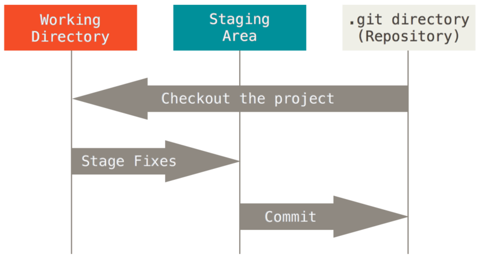
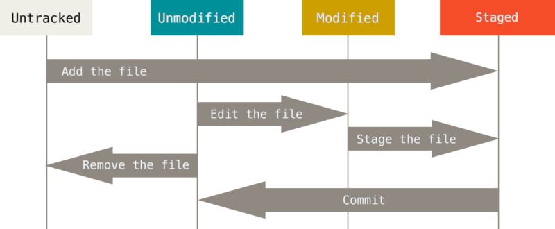

## Git分布式版本控制工具

### Git简介

Git是用C语言开发的分布式版本控制系统，所谓版本控制系统，就是可以储存一个文件在不同时间的版本，记录每次文件的改动，可以根据需要，随时切换到之前的版本(比如在编写Word文档的过程中，能记录下你每一次保存下来的记录，如果你对于现在的修改不满意，就可以回退到之前保存的版本)。
下面是Git的一些基础：

- 直接记录快照，而非差异比较
Git 把数据看作是对小型文件系统的一组快照。 每次提交更新，或在 Git 中保存项目状态时，它主要对当时的全部文件制作一个快照并保存这个快照的索引。 为了高效，如果文件没有修改，Git 不再重新存储该文件，而是只保留一个链接指向之前存储的文件。 Git 对待数据更像是一个 快照流。

- 近乎所有操作都是本地执行
在 Git 中的绝大多数操作都只需要访问本地文件和资源，一般不需要来自网络上其它计算机的信息。

- Git 保证完整性
Git 中所有数据在存储前都计算校验和，然后以校验和来引用。不可能在 Git 不知情时更改任何文件内容或目录内容。

- Git 一般只添加数据
你执行的 Git 操作，几乎只往 Git 数据库中增加数据。 很难让 Git 执行任何不可逆操作，或者让它以任何方式清除数据。 同别的 VCS 一样，未提交更新时有可能丢失或弄乱修改的内容；但是一旦你提交快照到 Git 中，就难以再丢失数据，特别是如果你定期的推送数据库到其它仓库的话。

- Git只能跟踪文本文件的改动
Git只能跟踪文本文件的改动，比如TXT文件、网页、程序代码等等。关于二进制文件，可以由Git进行管理，但是无法跟踪文件的变化。

### Git安装

#### Linux安装

如果你想在 Linux 上用二进制安装程序来安装 Git，可以使用发行版包含的基础软件包管理工具来安装。 如果以 Fedora 上为例，你可以使用 yum：

```sh
sudo yum install git
```

如果你在基于 Debian 的发行版上，请尝试用 apt-get：

```sh
sudo apt-get install git
```

#### Windows安装

通过Git官网下载，一步步安装即可。

### Git配置文件位置

Git 自带一个 git config 的工具来帮助设置控制 Git 外观和行为的配置变量。 这些变量存储在三个不同的位置：

1. /etc/gitconfig 文件: 包含系统上每一个用户及他们仓库的通用配置。 如果使用带有 --system 选项的 git config 时，它会从此文件读写配置变量。
2. ~/.gitconfig 或 ~/.config/git/config 文件：只针对当前用户。 可以传递 --global 选项让 Git 读写此文件。
3. 当前使用仓库的 Git 目录中的 config 文件（就是 .git/config）：针对该仓库。

每一个级别覆盖上一级别的配置，所以 .git/config 的配置变量会覆盖 /etc/gitconfig 中的配置变量。

### 配置用户信息

```sh
# 配置全局用户名和邮箱
git config --global user.name "Your Name"
git config --global user.email "email@example.com"
```

```sh
# 配置当前仓库用户名和邮箱
git config user.name "gitlab’s Name" 
git config user.email "gitlab@xx.com"
```

```sh
git config --list   # 查看配置列表
```

### 创建版本库

```sh
mkdir learngit      # 创建文件夹
cd learngit         # 切换到新建的文件夹
git init            # 创建一个空的Git仓库或重新初始化已有仓库
```

### Git中文件的三种状态

Git中的文件存在三种状态，已提交（committed）、已修改（modified）和已暂存（staged）。

- 已提交(committed): 表示数据已经安全的保存在本地数据库中。
- 已修改(modified): 表示修改了文件，但还没保存到数据库中。
- 已暂存(staged): 表示对一个已修改文件的当前版本做了标记，使之包含在下次提交的快照中。

由此引入 Git 项目中三个工作区域的概念: Git 仓库、工作目录以及暂存区域。

- 工作目录(Working Directory): 工作目录是对项目的某个版本独立提取出来的内容。这些从 Git 仓库的压缩数据库中提取出来的文件，放在磁盘上供你使用或修改。
- 暂存区域(Staging Area): 暂存区域是一个文件，保存了下次将提交的文件列表信息，一般在 Git 仓库目录中。 有时候也被称作"索引"，不过一般说法还是叫暂存区域。
- Git仓库(Repository): Git 仓库目录是 Git 用来保存项目的元数据和对象数据库的地方。 这是 Git 中最重要的部分，从其它计算机克隆仓库时，拷贝的就是这里的数据。

如果 Git 目录中保存着的特定版本文件，就属于已提交状态。 如果作了修改并已放入暂存区域，就属于已暂存状态。 如果自上次取出后，作了修改但还没有放到暂存区域，就是已修改状态。



### 查看工作目录当前状态

```sh
# 查看状态报告
git status
# 更为紧凑的格式输出
git status -s
git status --short
```

### 跟踪新文件

```sh
# 添加内容到暂存区域(.git文件夹中index文件)
git add <file>
# 将当前目录所有文件添加到暂存区域
git add .
# 当前项目下的所有更改
git add --all 
```

可以用它开始跟踪新文件，或者把已跟踪的文件放到暂存区，还能用于合并时把有冲突的文件标记为已解决状态等

### 查看已暂存和未暂存的修改

```sh
# 比较工作目录中当前文件和暂存区域快照之间的差异，也就是修改之后还没有暂存起来的变化内容。
git diff
# 比较暂存区域和本地仓库之间的差异，也就是暂存之后还未提交起来的变化内容
git diff --cached
# Git 1.6.1 及更高版本查看已暂存的将要添加到下次提交里的内容
git diff --staged
```

### 提交修改

```sh
git commit 
# 将提交信息与命令放在同一行
git commit -m "message"
# 跳过使用暂存区域，自动把所有已经跟踪过的文件暂存起来一并提交
git commit -a -m "added new benchmarks"
```

### 移除文件

要从 Git 中移除某个文件，就必须要从已跟踪文件清单中移除（确切地说，是从暂存区域移除），然后提交。可以用 git rm 命令完成此项工作，并连带从工作目录中删除指定的文件，这样以后就不会出现在未跟踪文件清单中了。

```sh
# 简单的从工作目录中移除文件
rm <file>
# 删除未暂存的文件，并记录此次移除文件的操作
git rm <file> 
# 将文件从Git仓库中移除，但是仍保留在当前工作目录中
git rm --cached <file>
```

### 移动文件

Git不会显式跟踪文件移动操作，如果重命名了某个文件，仓库中存储的元数据并不会体验出这是一次改名操作。如果直接修改文件名称，使用`git status`命令后，会显示如下信息。

```sh
On branch master
Changes not staged for commit:
(use "git add/rm <file>..." to update what will be committed)
(use "git restore <file>..." to discard changes in working directory)
        deleted:    oldfilename

Untracked files:
(use "git add <file>..." to include in what will be committed)
    newfilename
```

接着使用`git add .`将修改记录添加至暂存区，此时再使用`git status`，可以看到Git成功识别到了改名操作。

```sh
On branch master
Changes to be committed:
(use "git restore --staged <file>..." to unstage)
        renamed:    oldfilename -> newfilename
```

Git给出了一个mv命令，在需要对文件进行改名时，可以使用`git mv file_from file_to`，使用此命令修改文件名字后，与上面的效果相同。
其实，运行 git mv 就相当于运行了下面三条命令：

```sh
mv file_from file_to
git rm file_from
git add file_to
```

### 查看提交历史

使用最简单而又有效的工具是`git log`命令。在项目中运行`git log`，可以看到下面的输出：

```sh
git log
commit ca82a6dff817ec66f44342007202690a93763949
Author: Scott Chacon <schacon@gee-mail.com>
Date:   Mon Mar 17 21:52:11 2008 -0700

    changed the version number

commit 085bb3bcb608e1e8451d4b2432f8ecbe6306e7e7
Author: Scott Chacon <schacon@gee-mail.com>
Date:   Sat Mar 15 16:40:33 2008 -0700

    removed unnecessary test

commit a11bef06a3f659402fe7563abf99ad00de2209e6
Author: Scott Chacon <schacon@gee-mail.com>
Date:   Sat Mar 15 10:31:28 2008 -0700

    first commit
```

下面是一些查看提交历史的简单命令：

```sh
# 默认不用任何参数会按提交时间列出所有的更新，最近的更新排在最上面。
git log
# -p 用来显示每次提交的内容差异，可以加上 -2 来仅显示最近两次提交。
git log -p -2
# 如果你想看到每次提交的简略的统计信息，可以使用 --stat 选项。
git log --stat
# --pretty选项可以指定使用不同于默认格式的方式展示提交历史。
# 用 oneline 将每个提交放在一行显示，查看的提交数很大时非常有用。 
git log --pretty=oneline
# 另外还有 short，full 和 fuller 可以用，展示的信息或多或少有些不同。
# format，可以定制要显示的记录格式，还有很多其他选项，可以查看 Git 文档。
git log --pretty=format:"%h - %an, %ar : %s"
```

### 版本回退

1. HEAD指向的版本就是当前版本，因此，Git允许我们在版本的历史之间穿梭，使用命令`git reset --hard commit_id`。
2. 穿梭前，用`git log`可以查看提交历史，以便确定要回退到哪个版本。
3. 要重返未来，用`git reflog`查看命令历史，以便确定要回到未来的哪个版本。

### 撤销操作

::: tips
**提示**
`git checkout` 这个命令承担了太多职责，既被用来切换分支，又被用来恢复工作区文件，对用户造成了很大的认知负担。Git社区发布的Git2.23版本中，引入了两个新命令 `git switch` 和 `git restore`，用以替代现在的 `git checkout`。换言之，`git checkout` 将逐渐退出历史舞台。
:::

#### 重新提交(Git 仓库)

在已经提交后，发现漏掉几个文件没有添加，或者提交信息写错了。此时可以运行带有`--amend`提交命令尝试重新提交。最终只会有一个提交，第二次提交将替代第一次提交的结果。

```sh
git commit --amend
git commit --amend -m  "message"
```

#### 取消暂存的文件(暂存区域)

```sh
# 丢弃暂存区的修改，重新放回工作区。相当于撤销git add 操作，不影响上一次commit后对本地文件的修改，包括对文件的操作，如添加文件、删除文件。
git reset HEAD <file_name> 
# 清空暂存区，重置工作区的版本至上一次提交前
git reset –hard HEAD 
# 恢复暂存区的所有文件到工作区
git checkout .
```

#### 取消对文件的修改(工作目录)

```sh
# 将暂存区的修改重新放回工作区（包括对文件自身的操作，如添加文件、删除文件）
git restore --staged <file_name> 
# 丢弃文件在工作目录的修改（不包括对文件自身的操作，如添加文件、删除文件）
git restore <file_name> 
```



### 忽略文件

文件 .gitignore 的格式规范如下：

1. 所有空行或者以 # 开头的行都会被 Git 忽略。
2. 可以使用标准的 glob 模式匹配。
3. 匹配模式可以以（/）开头防止递归。
4. 匹配模式可以以（/）结尾指定目录。
5. 要忽略指定模式以外的文件或目录，可以在模式前加上惊叹号（!）取反。

所谓的 glob 模式是指 sh 所使用的简化了的正则表达式。 星号 (*) 匹配零个或多个任意字符；\[abc\] 匹配任何一个列在方括号中的字符（这个例子要么匹配一个 a，要么匹配一个 b，要么匹配一个 c）；问号（?）只匹配一个任意字符；如果在方括号中使用短划线分隔两个字符，表示所有在这两个字符范围内的都可以匹配（比如 \[0-9\] 表示匹配所有 0 到 9 的数字）。 使用两个星号 (\*\*) 表示匹配任意中间目录，比如a/**/z 可以匹配 a/z, a/b/z 或 a/b/c/z等。

### 远程仓库

远程仓库是指托管在因特网或其他网络中的你的项目的版本库。可以同时拥有多个远程仓库，这些仓库部分拥有只读权限，部分仓库拥有读写权限。 与他人协作涉及管理远程仓库以及根据需要推送或拉取数据。 管理远程仓库包括了解如何添加远程仓库、移除无效的远程仓库、管理不同的远程分支并定义它们是否被跟踪等等。

```sh
# 查看远程仓库
# 列出指定的每一个远程服务器的简写。
git remote
# 显示需要读写远程仓库使用的 Git 保存的简写与其对应的 URL。
git remote -v
# 查看某一个远程仓库的更多信息， 包含远程仓库的 URL 与跟踪分支的信息、拉取到的所有远程引用等等。
git remote show remote-name

# 添加远程仓库
# 添加一个新的远程 Git 仓库，同时指定一个轻松引用的简写
git remote add shortname remote-url

# 远程仓库的重命名
git remote rename oldname newname # 修改远程仓库的简写名

# 移除远程仓库
git remote rm remote-name

# 将某个远程仓库的更新全部取回本地,并不会自动合并或修改你当前的工作
git fetch remote-name
# 从远程仓库取回特定分支的更新
git fetch remote-name branch-name

# 将远程主机的某个分支的更新取回，并与本地指定的分支合并
git pull remote-name remote-branch:local-branch

# 推送到远程仓库，必须将先前的推送拉取下来并合并后才可以推送
git push remote-name branch-name
```

### 打标签

Git 可以给历史中的某一个提交打上标签，以示重要。

#### 查看标签

```sh
git tag                 # 列出已有标签，按照字母顺序
git tag -l "regex"      # 使用特定的模式查找标签
git show {tag-name}     # 查看某个具体标签的信息
```

#### 标记标签

Git 使用两种主要类型的标签：轻量标签（lightweight）与附注标签（annotated）。

轻量标签（lightweight tag）仅仅是一个指向特定提交的引用，它不会存储任何额外的信息。创建轻量标签的命令如下：

```sh
git tag {标签名} {提交ID}
```

附注标签（annotated tag）是存储在Git数据库中的一个完整对象，它有一个标签名，标签信息，标签签名等信息。创建附注标签的命令如下：

```sh
git tag -a {标签名} -m "{标签信息}" {提交ID}
```

**注意**：创建标签时，如果不指定提交ID，默认会使用当前所在分支的最新提交作为标签指向的提交。

#### 推送标签

默认情况下，git push命令不会将标签推送到远程服务器，需要使用以下命令将标签推送到远程服务器：

将标签推送到远程服务器

```sh
git push origin {标签名}
```

要一次性推送所有本地标签到远程服务器

```sh
git push origin --tags
```

#### 删除标签

```sh
git tag -d {标签名}
```

```sh
git push origin :refs/tags/{标签名}
```

### Git 分支

为何 Git 的分支模型如此出众呢？ Git 处理分支的方式可谓是难以置信的轻量，创建新分支这一操作几乎能在瞬间完成，并且在不同分支之间的切换操作也是一样便捷。Git 鼓励在工作流程中频繁地使用分支与合并，哪怕一天之内进行许多次。

#### 分支切换

```sh
git checkout {分支名}
```

#### 分支的创建与合并

在工作时，经常会经历如下步骤：

1. 开发某个项目。
2. 为实现某个新的需求，创建一个分支。
3. 在这个分支上开展工作。

正在此时，可能发布的线上版本有一个严重的问题需要紧急修补。将按照如下方式进行处理：

1. 切换到线上分支（production branch）。
2. 为这个紧急任务新建一个修补分支，并在其中修复它。
3. 在测试通过之后，切换回线上分支，然后合并这个修补分支，最后将改动推送到线上分支。
4. 切换回最初工作的分支，继续工作。

```sh
# 创建一个新的分支
git branch {分支名} 
# 创建一个新的分支并切换到该分支上
git checkout -b {分支名}    
```

```sh
# 删除分支
git branch -d {分支名}  
```
