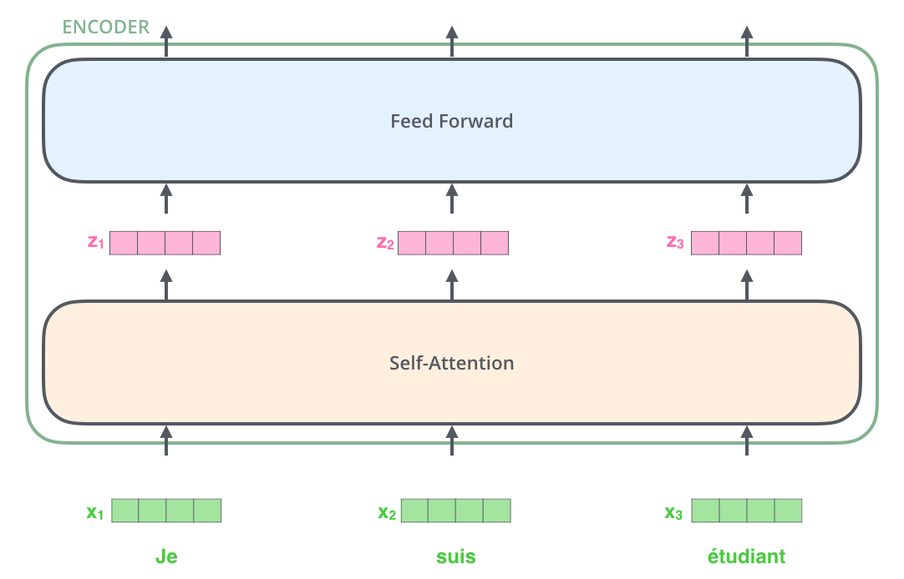
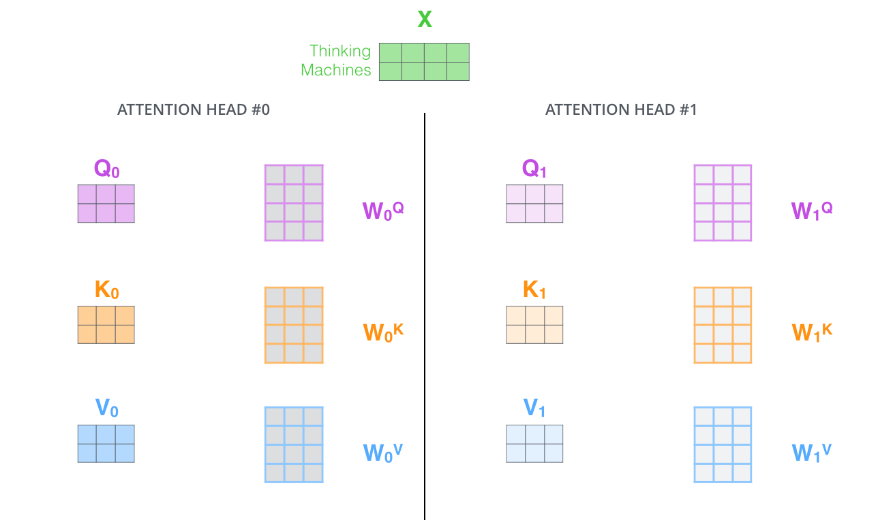
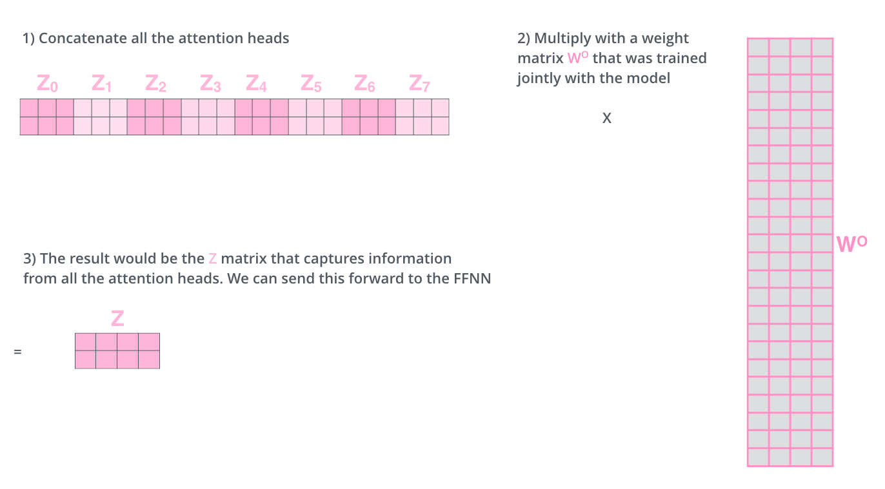
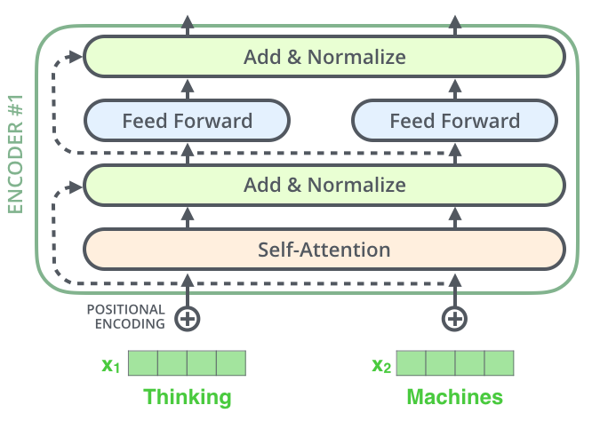
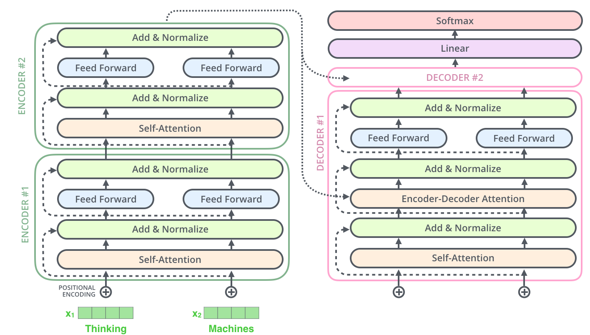
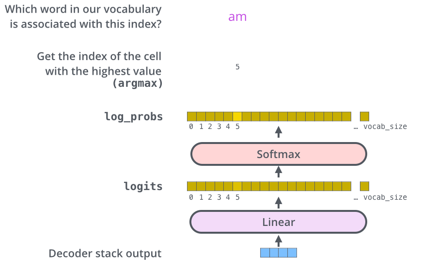

翻译自http://jalammar.github.io/illustrated-transformer/

## 整体角度

让我们将模型看作一个黑盒，在机器翻译应用中，它接收一种语言的句子，并输出另一种语言的翻译。

打开这个擎天柱的内部，我们可以看到编码器端、解码器端以及它们之间的连接。(因为这篇论文提出的模型叫做transformer，而在英语中还有变形金刚的意思，而在变形金刚中擎天柱是汽车人的领导者。)

编码器端是由一堆编码器堆叠而成(在transformer论文中，使用了6层)，解码器端也是同样数量的解码器的堆叠。

所有编码器在结构上都是相同的，但是它们不共享权重。每个编码器可以被分解为两个子层。

编码器的输入首先进入一个自注意力层——一个帮助编码器在编码特定单词时查看输入句子中其他单词的层。我们稍后会在本文中更加详细的介绍自注意力。

自注意力层的输出会被送到前馈神经网络层。完全相同的前馈神经网络独立的应用于每个位置。

解码器同样具有这两层，但是在这两层中间又添加了一个注意力层，用来帮助解码器集中关注句子的相关部分（类似于seq2seq模型中的注意力机制）。

## 引入张量

现在我们已经了解了模型的主要组成部分，接下来让我们开始看看各种向量/张量是如何在这些组件之间流动以及如何将输入经过训练的模型转为输出的。

一般情况下，在自然语处理应用中，我们首先使用嵌入算法将每个输入的单词转为一个向量。每个单词被转换为一个大小为512的向量。我们将用这些简单的框表示这些向量。

嵌入层只在最底层的编码器中出现。所有编码器共有的抽象是，它们接收一个向量列表，每个向量的大小为512。在最底层的编码器中，它接收输入序列词嵌入转换后的向量列表，但是在其他编码器中，接收下一层的输出作为输入。这个列表的大小是一个超参数，一般是训练数据集中最长句子的长度。

对输入序列中的词进行嵌入转换后，它们每次都会经过编码器的两个层。

这里我们开始看到Transformer的一个关键特性，即每个位置上的单词都会在编码器中通过自己的路径流动。在自注意力层中，这些路径之间存在依赖关系。然而，在前馈神经网络层没有这些路径依赖关系，因此在通过前馈层时，各个路径可以并行执行。

## 现在开始编码

正如我们之前提到的，编码器接收一个向量列表作为输入。它通过将这些向量传递到自注意力层，然后传递到前馈神经网络来处理这个列表，然后将输出向上发送到下一个编码器。

每个位置上的单词都会通过自注意力层的处理。然后，它们都会通过一个前馈神经网络 —— 每一个向量都会独立地通过完全相同地网络进行处理。

## 高层次地自注意力机制

不要被我随意使用“self-attention”这个词而感到困惑，这好像是每个人都应该熟悉的概念。但是就我个人而言，在阅读《Attention is All You Need》论文之前，我从未接触过这个概念。让我们梳理一下它是怎么工作的。

假设以下句子是我们想要翻译的输入句子：

”`The animal didn't cross the street because it was too tired`”

在这个句子中，"it"指的是什么?它是指这条街道还是这只动物?对于人类来说，这是一个简单的问题，但是如果从算法的角度来考虑却没那么简单。

当模型处理单词 “it” 时，自注意力使它能够将 “it” 与 “animal” 关联起来。

当模型处理每个单词（输入序列中的每个位置）时，自注意力允许它查看输入序列中的其他位置，以获取有助于更好地对该单词进行编码的线索。

如果你熟悉RNN,可以把它维护一个隐状态的方式看作是RNN将它对前面单词/向量的表示与当前处理的单词相结合的方式。自注意力机制可以看作是Transformer模型关联前后文信息,将上下文语义融入当前词表示的关键机制。

当我们在第5个编码器(栈顶编码器)中编码“it”这个词时,注意力机制的一部分聚焦在了“The Animal”上,并将其表示的一部分融合到了“it”的编码中。

## 自注意力机制的细节

让我们先看看如何使用向量计算自注意力，然后查看它的实际实现——使用矩阵。

计算自注意力的**第一步**是从编码器的每个输入向量(在本例中，每个词的嵌入向量)创建三个向量。所以对于每个词，我们创建一个查询向量、键向量和值向量。这些向量是通过将嵌入向量与训练过程中学习到的三个矩阵相乘而创建的。

注意，这些新向量的维度比嵌入向量的维度小。它们的维度是64，而嵌入向量和编码器输入/输出向量的维度是512。它们不一定要更小，这是一种架构选择，以使多头注意力的计算量是常数级别的。

什么是查询、键、值向量？

它们是注意力计算和思考中有用的抽象概念。在下面阅读注意力计算方式后，你会对每个向量扮演的角色有足够的了解。

计算自注意力的**第二步**是计算分数，假设我们正在计算第一个词“Thinking”的自注意力。我们需要对输入句子的每个词根据该词给出一个分数。这个分数决定了当我们编码某个位置的词时，应该关注输入句子的其它部分的多少。

分数的计算是通过查询向量与我们正在评分的词的键向量的点积来实现的。所以如果我们正在处理位置#1的词的自注意力，第一个分数将是q1与k1的点积。第二个分数将是q1和k2的点积。

计算自注意力的**第三步**和**第四步**是将分数除以8（论文中使用的键向量的维度64的平方根。这可以让梯度更加稳定。这里也可以使用其他值,但默认是8)），然后将结果传递给softmax操作。Softmax将分数归一化，是他们都是正数并且加起来等于1.

这个softmax分数决定了每个词在该位置的表达程度。显然，该位置上的词将具有最高的softmax分数，但有时候关注与当前词相关的另一个词也很有用。

具体来说:

softmax分数表示了每个词对当前词位置的注意力权重。当前词位置上的词通常有最高的权重，但是其他相关词的权重也可能较高。权重越高,表示该词对当前词越重要。通过注意力权重，可以关注与当前词相关的其他词。这使得模型可以利用整个上下文的信息，不仅仅依赖当前词本身,还融入其他相关词的表达。这种融合上下文信息的能力是自注意力的优势。

计算自注意力的**第五步**是将每一个值向量与softmax分数相乘（准备将它们相加）。这里的直觉是保持我们想要关注的词的值不变,并淹没不相关的词(例如将它们与0.001这样的小数相乘)。

**第六步**是对加权的价值向量求和。这将产生自注意力层在该位置的输出(对于第一个词)。

这就完成了自注意力的计算，得到的向量可以输入到前馈神经网络。然而，在实际实现中，计算以矩阵形式完成，以实现更快速的处理。现在我们已经了解了词级计算的概念，让我们来看看实际的矩阵实现。

## 自注意力的矩阵计算

计算自注意力的**第一步**是计算查询(Query)、键(Key)和值(Value)矩阵。我们通过将多个嵌入词向量concat成为矩阵X，并将其与我们训练好的权重矩阵(W~Q~、W~K~，W~V~)相乘来完成此操作。

**最后**,由于我们处理的是矩阵,我们可以用一个公式把步骤二到六合并,来计算自注意力层的输出。

## 多头怪兽

这篇论文通过添加一种多头注意力机制进一步改进了自注意力层。这从两个方面提高了注意力层的性能:

1. 它扩展了模型关注不同位置的能力。在上面的例子中，z1包含了每一个其他编码的一小部分,但它可能会被词本身主导。如果我们正在翻译这样一句话:“The animal didn’t cross the street because it was too tired”,知道“it”指的是哪个词会很有用。
2. 它为注意力层提供了多个“表示子空间”。接下来我们会看到，使用多头注意力,我们不仅有一个，而是有多个查询/键/值权重矩阵组（Transformer使用8个注意力头,所以我们最终会为每个编码器/解码器得到8个组）。每个组都是随机初始化的。然后，在训练后，每个组用于将输入嵌入(或来自下层编码器/解码器的向量)投影到不同的表示子空间中。

对于多头注意力，我们为每个头保留单独的Q/K/V权重矩阵，从而产生不同的Q/K/V矩阵。正如我们之前所做的，我们将X乘以W~Q~/W~K~/W~V~矩阵得到Q/K/V矩阵。

如果我们做与上面概述相同的自注意力计算，只是用不同的权重矩阵做8次，我们最终会得到8个不同的Z矩阵。

这给我们提出了一个小挑战。前馈层希望得到的不是8个矩阵， 而是一个单一的矩阵(每个词一个向量)。所以我们需要一种方法来将这8个矩阵凝聚成一个单一的矩阵。

我们该如何做到这一点呢?我们连接这些矩阵，然后将它们乘以一个额外的权重矩阵W^O^。

这就构成了多头自注意力的全部。我意识到这涉及到大量的矩阵，让我试着将它们都放在一个视觉界面中,这样我们可以一起看到它们:

既然我们已经接触了注意力头，让我们重新审视之前的例子，看看在我们对示例句子中的“it”进行编码时，不同的注意力头都关注在哪里:

当我们对“it”这个词进行编码时，一个注意力头集中在“the animal”上，而另一个注意力头则集中在“tired”上——从某种意义上说，模型对“it”这个词的表示与“the animal”和“tired”的一些表示一样。

然而，如果我们添加所有注意力头到图片中，可能会更难以解释:

## 使用位置编码表示序列顺序

到目前为止，我们描述的模型中缺少一种考虑输入序列中词顺序的方法。

为了解决这个问题，transformer会向每个输入嵌入加上一个向量。这些向量遵循模型学习的一个特定模式，它帮助模型确定每个词的位置，或者序列中不同词之间的距离。这里的直觉是,将这些值加到嵌入向量中，在它们被投影到Q/K/V向量并在点积注意力期间，为嵌入向量之间提供有意义的距离。

为了让模型了解到单词的顺序，我们添加了值遵循特定模式的位置编码向量。

如果我们假设嵌入的维度为4，实际的位置编码看起来如下:

这个模式可能是什么样的呢?

在下面的图中，每一行对应一个向量的位置编码。所以第一行将是我们加到输入序列中第一个词的嵌入的向量。每一行包含512个值 - 每个值介于1和-1之间。我们用不同的颜色进行了编码，使得这个模式可见。

嵌入大小为512（列）的20个字（行）的位置编码的真实示例。你可以看到看起来像是从中心一分为二。这是因为左半部分的值是由一个函数（使用正弦）生成，右半部分由另一个函数生成（使用余弦）。然后将它们连接起来已形成每个位置编码向量。

位置编码的公式在论文中有描述(第3.5节)。你可以在`get_timing_signal_1d()`中看到生成位置编码的代码。这不是位置编码的唯一可能方法。然而，它具有扩展到未知序列长度的优势（例如,如果我们训练好的模型被要求翻译长度超过训练集中任何句子的句子）。

上面显示的位置编码来自Transformer的Tensor2Tensor实现。论文中显示的方法略有不同，它没有直接连接,而是交织这两个信号。下图显示了它的样子：

## 残差连接

在继续讨论编码器架构之前，我们需要提到一个细节是，每个编码器中的每个子层（自注意力层、前馈全连接网络）都在其周围有一个残差连接，并且后面跟着一个Layer Norm步骤。

如果我们可视化与自注意力相关的向量和Layer Norm操作，它看起来像这样:

解码器的子层也一样。如果我们考虑一个由2个编码器和解码器堆叠的Transformer，它看起来会是这样:

## 解码器端

现在我们已经涵盖了编码器端的绝大多数概念，我们基本上也知道解码器组件的工作方式。但让我们看看它们是如何协同工作的。

编码器首先处理输入序列，然后顶层编码器的输出被转化为一组注意力向量K和V。这些将被每个解码器在其“encoder-decoder attention”层使用，该层帮助解码器关注输入序列中的适当位置:

编码阶段完成后，我们开始解码阶段。解码阶段的每个步骤输出序列的一个元素(在本例中是英语句子的翻译)。

下面的步骤会重复这个过程，直到达到一个特殊的符号，表明transformer解码器已经完成了其输出。每个步骤的输出被馈送到下一个时间步的底层解码器，解码器像编码器一样传递它们的解码结果。和我们对编码器输入所做的一样，我们解码器输入进行嵌入编码并添加位置编码来指示每个词的位置。

解码器中的自注意力层的操作方式与编码器中的略有不同:

在解码器中，自注意力层只允许关注输出序列中的先前位置。这是通过在自注意力计算的softmax步骤之前，屏蔽(设置为`-inf`)未来位置来完成的。

“encoder-decoder attention”层的工作方式与多头自注意力层类似，只不过它从下层获取Query，并从编码器端的输出中获取Key和Value。

总结解码器端的工作流程:

1. 解码器包含两层注意力机制：自注意力层和编码器-解码器注意力层。
2. 自注意力层只关注当前位置之前的输出，避免使用未来信息。
3. 编码器-解码器注意力层将编码器输出作为键和值，和当前解码器层查询交互。
4. 通过这两层注意力，解码器可以利用输入序列和已生成序列的上下文信息。
5. 解码器通过这种上下文注意力生成翻译输出，依次生成序列,实现神经机器翻译。

## 最终线性层和softmax层

解码器端输出一个浮点数向量。我们如何将其转化为词呢？这是最终线性层后面连接的softmax层的工作。

线性层是一个简单的全连接神经网络，它将解码器端产生的向量投影到一个的更大的向量中，称为logits向量。

假设我们的模型从训练集中学习到了10,000个唯一的英语词汇表（模型的“输出词汇表”）。这将使logits向量的宽度为10,000个单元格 - 每个单元格对应一个唯一词汇的得分。这就是我们对线性层之后模型输出的解释。

然后softmax层将那些得分转化为概率（全部为正,全部加和为1.0)，选择概率最高的单元格，并产生与其相关的词作为该时间步的输出。

总结一下从解码器到输出词的转换过程:

1. 解码器输出一个浮点向量。
2. 通过全连接层映射到更高维的logits向量，每个维度表示一个词的得分。
3. 对logits向量做softmax,得到单词概率分布。
4. 选取概率最大的单词作为当前时间步的输出。
5. 不断重复这一过程,生成输出序列。
6. 线性层和softmax层起到分类作用,实现seq2seq模型的解码。

这就是Transformer将编码器向量转变为翻译输出的最后一步。

## 训练回顾

现在我们已经介绍了Transformer的整个前向传播过程，回顾一下模型训练会有帮助。

在训练过程中，一个未训练的模型会经历完全相同的前向传播。但是由于我们在标注训练集上训练它，我们可以将它的输出与实际的正确输出进行比较。

为了可视化这个过程，让我们假设我们的输出词汇表只包含6个词（"a","am","i","thanks","student"和"<eos>"（表示句子结束））。

在我们开始训练之前的预处理阶段，我们的模型输出词汇表就已经创建。

一旦我们定义了输出词汇表，我们就可以使用具有相同宽度的向量来表示词汇表中的每个词。这也称为独热编码。例如，我们可以使用以下向量来表示“am”这个词:

在这个回顾之后，让我们讨论模型的损失函数 - 训练阶段优化的指标，以获得一个经过训练和极其准确的模型。

## **损失函数**

假设我们正在训练模型，并且我们处于训练阶段的第一步，用一个简单的例子进行训练 - 将“merci”翻译成“thanks”。

这意味着我们希望输出是一个概率分布，指示单词“thanks”。但是由于这个模型还没有训练,这不太可能立即发生。

由于模型的参数(权重)都是随机初始化的，所以(未训练的)模型为每个单元格/词产生具有任意值的概率分布。我们可以将其与实际输出进行比较，然后使用反向传播调整模型的所有权重，使输出更接近期望输出。

你如何比较两个概率分布呢？我们简单地将一个减去另一个。更多详情，请参阅 [cross-entropy](https://colah.github.io/posts/2015-09-Visual-Information/) 和 [Kullback–Leibler divergence](https://www.countbayesie.com/blog/2017/5/9/kullback-leibler-divergence-explained)。

但请注意，这是一个过于简化的例子。我们会使用长度大于一的句子。例如：输入“je suis étudiant”，期望输出：“i am a student”。这实际上意味着我们希望模型逐步输出概率分布，其中:

- 每个概率分布由vocab_size宽的向量表示（在我们的简易例子中是6，但实际是3万或5万这样的数字）
- 第一个概率分布在与单词“i”相关的单元上概率最高
- 第二个概率分布在与单词“am”相关的单元上概率最高
- 以此类推。直到第五个输出分布指示“<end of sentence>”符号，它在10,000元素词汇表中也有一个相关的单元。

在足够长的时间内对足够大的数据集进行训练后，我们希望产生的概率分布如下所示:

希望在训练后，模型会输出我们期望的正确翻译。当然，如果这个短语是训练集的一部分,这并不是真正的指标（参见：[cross validation](https://www.youtube.com/watch?v=TIgfjmp-4BA)）。注意，即使不太可能是该时间步的输出，每个位置也会获得一点概率。这是softmax的非常有用的属性，可以有助于训练过程。

现在，因为模型逐个产生输出，我们可以假设模型正在从该概率分布中选择概率最高的单词，并忽略其余部分，这是一种贪婪解码。另一种方法是保留前两个词（例如“I”和“a”），然后在下一步中，对模型运行两次：一次假设第一输出位置是“I” ,另一次假设第一输出位置是“a”，哪个版本考虑位置#1和#2时产生的误差更小，就保留哪个。我们对位置#2和#3重复此过程...等等。这种方法称为“束搜索”，在我们的示例中，beam_size为2（意味着在任何时候都保留两个部分假设（未完成的翻译）在内存中），top_beams也为2（意味着我们将返回两个翻译）。这些都是你可以尝试的超参数。

## 展望

我希望这对您开启与Transformer的主要概念的破冰之旅有所帮助。如果您想深入了解，我建议您采取以下后续步骤:

- 阅读 [Attention Is All You Need](https://arxiv.org/abs/1706.03762) 论文，Transformer博客 ([Transformer: A Novel Neural Network Architecture for Language Understanding](https://ai.googleblog.com/2017/08/transformer-novel-neural-network.html))，和 [Tensor2Tensor announcement](https://ai.googleblog.com/2017/06/accelerating-deep-learning-research.html)。
- 观看 [Łukasz Kaiser的演讲](https://www.youtube.com/watch?v=rBCqOTEfxvg) ，详细介绍该模型以及细节。
- 使用 [Tensor2Tensor仓库提供的 Jupyter Notebook](https://colab.research.google.com/github/tensorflow/tensor2tensor/blob/master/tensor2tensor/notebooks/hello_t2t.ipynb)。
- 探索[Tensor2Tensor仓库](https://github.com/tensorflow/tensor2tensor)。

后续工作：

- [Depthwise Separable Convolutions for Neural Machine Translation](https://arxiv.org/abs/1706.03059)
- [One Model To Learn Them All](https://arxiv.org/abs/1706.05137)
- [Discrete Autoencoders for Sequence Models](https://arxiv.org/abs/1801.09797)
- [Generating Wikipedia by Summarizing Long Sequences](https://arxiv.org/abs/1801.10198)
- [Image Transformer](https://arxiv.org/abs/1802.05751)
- [Training Tips for the Transformer Model](https://arxiv.org/abs/1804.00247)
- [Self-Attention with Relative Position Representations](https://arxiv.org/abs/1803.02155)
- [Fast Decoding in Sequence Models using Discrete Latent Variables](https://arxiv.org/abs/1803.03382)
- [Adafactor: Adaptive Learning Rates with Sublinear Memory Cost](https://arxiv.org/abs/1804.04235)
