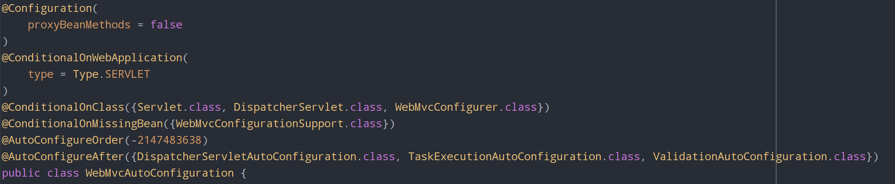
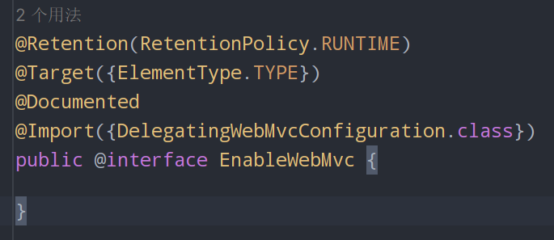
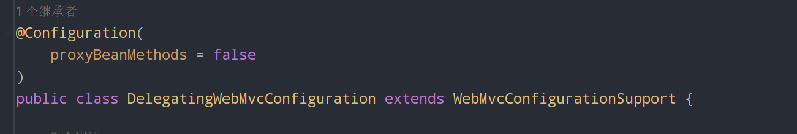

### 问题描述

在使用Spring Boot以及Vue开发过程中，在将Vue的文件进行打包生成静态文件后，生成了一个resources文件夹，其中包含了html、css、js等文件，也就是在后端开发中的classpath:/resources/目录，并且在Spring Boot的配置文件中设置了如下配置：

```properties
spring.mvc.static-path-pattern=/**
spring.web.resources.static-locations=classpath:/public/
```

但是在启动后Spring Boot项目后，访问静态资源时，发现无法访问到静态资源，而是直接返回了404错误，如下图所示：

### 解决思路

首先检查代码中是否使用了`@EnableWebMVC`注解，众所周知，Spring Boot为Spring MVC提供了自动配置功能，但是同时Spring Boot也提供了定制功能，如果想保留那些Spring Boot MVC定制，并进行更多的 [MVC定制](https://docs.spring.io/spring-framework/docs/6.1.0-M1/reference/html/web.html#mvc)（Interceptor、Formatter、视图控制器和其他功能），可以添加你自己的 `@Configuration` 类，类型为 `WebMvcConfigurer` ，但 **必须必须不** 含 `@EnableWebMvc`注解。

但是如果你想要完全控制Spring MVC，你可以添加你自己的 `@Configuration` 并使用 `@EnableWebMvc` 注解 ，或者添加你自己的 `@Configuration` 并使用 `DelegatingWebMvcConfiguration` 注解 ，如 `@EnableWebMvc` 的Javadoc中所述。

也就是说如果你想要使用配置文件对Spring Boot框架中的Spring Web MVC进行定制，那么就不要加上`@EnableWebMvc`注解。

### 问题原理

Spring Boot为Spring MVC提供了自动配置功能，接下来分析一下`WebMvcAutoConfiguration`配置类。



重点在于上面的两个注解，分别是

```java
@ConditionalOnClass({Servlet.class, DispatcherServlet.class, WebMvcConfigurer.class})
@ConditionalOnMissingBean({WebMvcConfigurationSupport.class})
```

`@ConditionalOnClass` 和 `@ConditionalOnMissingClass` 注解让 `@Configuration` 类基于特定类的存在或不存在而被包含。 由于注解元数据是通过使用 [ASM](https://asm.ow2.io/) 来解析的，你可以使用 `value` 属性来引用真正的类，即使该类可能没有实际出现在运行的应用程序classpath上。 如果你想通过使用 `String` 值来指定类的名称，你也可以使用 `name` 属性。

其中我们要关注一个类，就是`WebMvcConfigurationSupport`，上面的意思是如果出现了这个类，那么`WebMvcAutoConfiguration`配置类就不会生效。

接着查看`@EnableWebMvc`注解:



其中包含了一个导入注解，也就是导入`DelegatingWebMvcConfiguration`这个类，`DelegatingWebMvcConfiguration`与`WebMvcConfigurationSupport`有什么关系呢?

我们接着查看`DelegatingWebMvcConfiguration`这个类的声明:



可以看到它继承了`WebMvcConfigurationSupport`这个类，也就是说当你使用了`@EnableWebMvc`注解之后，Spring Boot的`WebMvcAutoConfiguration`配置类就不会起作用，那么也就是说你的配置文件就不会生效了。

在使用了`@EnableWebMvc`注解之后，如果你想要使用静态资源，只需要在你的自定义配置类中重写addResourceHandlers方法即可。
