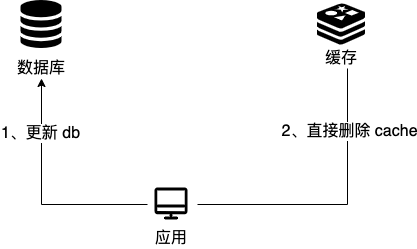
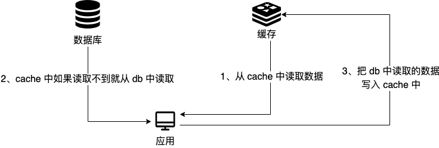
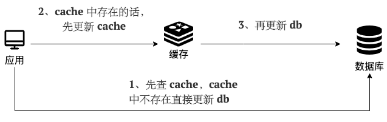
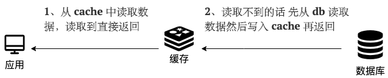

## 前言

在实际的项目开发中，为了提高响应的速度，通常都会将热点的数据保存到缓存中，减少数据库的查询，有效提高服务端的响应速度，但是添加缓存之后也引入缓存与数据库的一致性问题，本文将详细的讲解如何保证数据库与缓存的一致性。

### 一致性

一致性是指数据保持一致，在分布式系统中，可以理解为多个节点中的数据是一致的。

- 强一致性
- 弱一致性
- 最终一致性

## 缓存使用策略

### Cache-Aside Pattern

#### 介绍

Cache-Aside Pattern 简称旁路缓存模式，是业务系统最常用的缓存策略，适用的业务场景是“读多写少”。

- Cache只能被动的等待客户端发起请求，然后再进行处理。读取缓存、读取数据库和更新缓存的操作都需要在应用程序中来完成。

**写**:

1. 先更新db
2. 直接删除cache

**读**:

1. 从cache中读取数据，读取到就直接返回
2. cache读取不到，从db中读取数据返回
3. 将db读取到的数据放到cache中

#### 相关问题

1. 为什么删除cache，而不是更新cache?

   1. 对服务端资源造成浪费：删除cache更加直接，这是因为cache中存放的一些数据需要服务端经过大量计算才能得出，如果频繁修改db，就会导致频繁更新cache，而cache中的数据可能都没有被访问到。

   2. 产生数据不一致问题：并发场景下，更新cache产生数据不一致的概率会更大

      举例：请求1先写数据A，请求2随后写数据B

      1. 请求1先写数据A
      2. 请求2随后写数据B
      3. 请求2更新cache至数据B
      4. 请求1更新cache至数据A

      解决方案：缓存延迟双删

      1. 先删除缓存，再更新数据库
      2. 确保数据库事务提交成功后，休眠一段时间，然后再删除缓存
      3. 如果删除缓存失败，将删除失败的key存入消息队列，采用异步的方式进行删除，如果删除失败的次数超过了最大次数，那么发送警告。

2. 在写数据的过程中，可以先删除cache，后更新db吗？

   可能会导致数据库和缓存的数据不一致问题。

   举例：请求1先写数据A，请求2随后读数据A

   1. 请求1先把cache中的数据A删除
   2. 请求2从db中读取数据，并写入cache
   3. 请求1将db中的A数据更新

3. 在写数据的过程中，先更新db，后删除cache就没有问题了吗？

   理论上还有可能会出现数据不一致问题，但是概率很小，因为缓存的写入速度是比数据库的写入数据快很多

   举例：请求1先读数据A，请求2随后写数据库，并且数据A在请求1请求之前不在缓存中

   1. 请求1从db读数据A
   2. 请求2更新db中的数据（此时缓存中无数据A，故不用执行删除缓存操作）
   3. 请求1将数据A写入cache

#### 缺陷

1. 写操作比较频繁的话导致cache中的数据会频繁被删除，这样会影响缓存命中率。

   解决办法：

   1. 数据库和缓存数据强一致场景：更新db的时候同样更新cache，需要锁/分布式锁保证更新cache的时候不存在线程安全问题。
   2. 可以短暂允许数据库和缓存数据不一致的场景：更新db的时候同样更新cache，但是给缓存一个比较短的过期时间，这样可以保证即使数据不一致对业务的影响时间也比较小。

2. 在更新db后删除cache，有可能存在缓存击穿问题，假如在此时刻有大量请求涌入，会直接访问到数据库。

   举例：在抖音应用场景中，当某些大V发送新的视频后，可能会有大量请求涌入，这个时候，如果缓存过期，那么大量请求直接访问数据库

   解决办法：

   1. 利用互斥锁解决缓存击穿问题
   2. 利用逻辑过期解决缓存击穿问题

### Read/Write Through Pattern

#### 介绍

Read/Write Through Pattern 中服务端将cache视为主要数据存储，从中读取数据并将数据写入其中。cache服务负责将此数据读取和写入db，从而减轻了服务层的职责。

**写**

- 先查cache，cache中不存在，直接更新db
- cache中存在，则先更新cache，然后cache服务自己更新db（同步更新cache和db）

**读**

- 从cache中读取数据，读取到就直接返回
- 读取不到，先从db加载，写入到cache后返回响应

Read Through Pattern  实际上是在Cache Aside Pattern 之上进行了封装。在Cache-Aside Pattern下，发生读请求时，如果cache中不存在，是由服务层自己负责将数据写入cache，而Read Through Pattern则是cache自己来写入缓存，这对客户端是透明的。

### Write Behind Pattern 

Write Behind Pattern与Read/Write Through Pattern很相似，两者都是由cache服务来负责cache和db的读写。但是Write Behind Pattern是只更新缓存，不直接更新db，而是改为异步批量的方式来更新db。

Write Behind Pattern下db的写性能非常高，非常适合一些数据经常变化又对数据一致性要求没那么高的场景，比如浏览量、点赞量。
