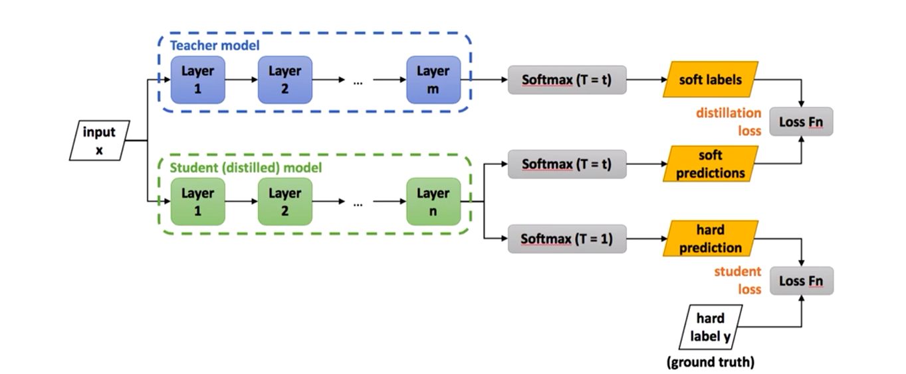

## 前言

轻量化神经网络 部署在移动端、终端边缘计算

1. **压缩已经训练好的模型**：知识蒸馏、权值量化、剪枝（权重剪枝、通道剪枝）、注意力迁移、NAS
2. **直接训练轻量化网络**：SqueezeNet、MobileNet v1/v2/v3、MnasNet、ShuffleNet v1/v2、Xception、EfficientNet、EfficientDet
3. **加速卷积运算**：im2col+GEMM、Winograd、低秩分解
4. **硬件部署**：TensorRT、Jetson、Tensorflow-slim、Tensorflow-lite、Openvino、FPGA、集成电路

**关键字**：参数量、计算量、内存访问量、耗时、能耗、碳排放、CUDA加速、对抗学习、Transformer、Attention、NAS（神经架构搜索）、嵌入式开发、FPGA、软硬件协同设计、移动端、边缘端、智能终端、预训练大模型的知识蒸馏

知识蒸馏和模型压缩的算法库：

OpenMMLab模型压缩工具箱 MMRazor（Pruning、KD、NAS、Quantization）

github/open-mmlab/mmrazor

OpenMMLab模型转换与部署工具箱 MMDeploy

github/open-mmlab/mmdeploy  

通过使用MMDeploy将MMCLS、MMDet、MMSeg、MMOCR、MMEdit、MMPose转为ONNX、Openvino、TensorRT、OpenPPL、ncnn、pplnn

12个SOTA知识蒸馏算法的pytorch复现 github.com/Hobbitlong/RepDistiller

## 论文解读

### 摘要		

​		集成多个模型预测可以提高机器学习算法的性能，但是在大规模用户部署时，受到计算资源昂贵以及延迟等限制。Caruana等人的工作显示，可以将多个模型压缩为单个易于部署的模型。

### 引言

​		类比昆虫的不同形态，在训练时使用复杂的模型、大量的计算资源以便从大规模、高度冗余的数据集中提取出信息。训练完毕后，使用蒸馏将知识从复杂模型转移到更适合部署的小模型。通过知识蒸馏训练出的模型要比直接在训练数据集上进行训练得到的模型性能和泛化性都要好。

​		类似于MNIST的任务，复杂模型总是可以以非常高的置信度产生正确的答案，但是许多暗信息都保存在非常小的概率中。例如在预测结果为2的情况下，3的预测概率的数量级为10^-6^，7的预测概率为10^-9^。这些在数据结构上是具有丰富的相似性结构的价值的信息，但是在蒸馏阶段因为概率非常接近0，对交叉熵损失函数的影响非常小。

​		Carunana等人采用logits的均方差作为目标函数来规避这个问题。这篇论文通过提高蒸馏温度T从teacher模型来获得合适的soft targets，并且蒸馏阶段的数据集可以采用原始训练集或者未标记的数据集。

### 蒸馏

$$
q_{i}=\frac{exp(z_{i}/T)}{\sum_{j}exp(z_{j}/T)}
$$

z~i~为softmax层的输入logit，T为蒸馏温度，q~i~为蒸馏后的概率，softmax函数是T=1的特例。当T越高，softmax的输出概率分布趋于平滑，其分布的熵越大，负标签携带的信息会被相对的放大。

蒸馏温度的特点：

1. 当T=1时，蒸馏函数为原始的softmax函数。当T<1时，概率分布比原始更”陡峭“。当T>1时，概率分布比原始更"平缓"。
2. 温度的高低改变的是训练过程中对负标签的关注程度：温度较低时，对负标签的关注，尤其是那些显著低于平均值的负标签的关注较少；而温度较高时，负标签相关的值会相对增大，会相对多地关注到负标签。
3. 蒸馏温度的设置与模型的大小相关。当模型参数量较小时，相对较低的温度可以适当的忽略掉一些父标签的信息。

$$
损失函数为:
L = \alpha L_{soft}+\beta L_{hard} \\
L_{soft} = -\sum_{j}^{N} p_{j}^{T}log(q_j^{T}), 其中
p_{i}=\frac{exp(v_{i}/T)}{\sum_{k}^{N}exp(v_{k}/T)}，
q_{i}=\frac{exp(z_{i}/T)}{\sum_{k}^{N}exp(z_{j}/T)}\\
L_{hard}=-\sum_{j}^{N}c_jlog(q_j^1),其中
q_i^1=\frac{exp(z_i)}{\sum_k^Nexp(z_k)} \\
v_{i}：Net_T的logits \\
z_{i}：Net_S的logits \\
p_i^T：Net_T在温度T下的softmax输出在第i类上的值\\
q_i^T：Net_S在温度T下的softmax输出在第i类上的值\\
c_i：在第i类上的ground truth值，c_i\in\{0, 1\}，正标签取1、负标签取0\\
N：总标签数量
$$

|      | 学生网络 logit | 学生网络softmax(T=1)                                     | 教师网络 logit | 教师网络softmax(T=1)                                        |
| ---- | -------------- | -------------------------------------------------------- | -------------- | ----------------------------------------------------------- |
| 猫   | -5             | $\frac{e^{-5}}{e^{-5}+e^{2}+e^{7}+e^{9}}=7.3182*10^{-7}$ | -10            | $\frac{e^{-10}}{e^{-10}+e^{0}+e^{3}+e^{12}}=2.789*10^{-10}$ |
| 狗   | 2              | $\frac{e^{2}}{e^{-5}+e^{2}+e^{7}+e^{9}}=8.0254*10^{-4}$  | 0              | $\frac{e^{0}}{e^{-10}+e^{0}+e^{3}+e^{12}}=6.143*10^{-6}$    |
| 驴   | 7              | $\frac{e^{7}}{e^{-5}+e^{2}+e^{7}+e^{9}}=0.1191$          | 3              | $\frac{e^{3}}{e^{-10}+e^{0}+e^{3}+e^{12}}=1.234*10^{-4}$    |
| 马   | 9              | $\frac{e^{9}}{e^{-5}+e^{2}+e^{7}+e^{9}}=0.88009$         | 12             | $\frac{e^{12}}{e^{-10}+e^{0}+e^{3}+e^{12}}=0.9987$          |

|      | 学生网络 logit | 学生网络softmax(T=3)                                        | 教师网络 logit | 教师网络softmax(T=3)                                         |
| ---- | -------------- | ----------------------------------------------------------- | -------------- | ------------------------------------------------------------ |
| 猫   | -5             | $\frac{e^{-5/3}}{e^{-5/3}+e^{2/3}+e^{7/3}+e^{9/3}}=0.0058 $ | -10            | $\frac{e^{-10/3}}{e^{-10/3}+e^{0/3}+e^{3/3}+e^{12/3}}=6.1136*10^{-4}$ |
| 狗   | 2              | $\frac{e^{-5/3}}{e^{-5/3}+e^{2/3}+e^{7/3}+e^{9/3}}=0.0599$  | 0              | $\frac{e^{-10/3}}{e^{-10/3}+e^{0/3}+e^{3/3}+e^{12/3}}=1.7137*10^{-2}$ |
| 驴   | 7              | $\frac{e^{-5/3}}{e^{-5/3}+e^{2/3}+e^{7/3}+e^{9/3}}=0.3170$  | 3              | $\frac{e^{-10/3}}{e^{-10/3}+e^{0/3}+e^{3/3}+e^{12/3}}=4.6584*10^{-2}$ |
| 马   | 9              | $\frac{e^{-5/3}}{e^{-5/3}+e^{2/3}+e^{7/3}+e^{9/3}}=0.6174$  | 12             | $\frac{e^{-10/3}}{e^{-10/3}+e^{0/3}+e^{3/3}+e^{12/3}}=0.93567$ |

### 在MNIST数据集上的测试

复杂模型在测试集的预测上出现了67个错误，而具有两个隐藏层的较小网络出现了146个错误，如果在T=20的蒸馏下仅仅出现了74个错误。这表明soft targets可以将大量知识转移到蒸馏模型中即使转移集中不包含任何标签。

尝试在传输集中不包含数字3，在蒸馏模型中，3是一个它从来没见过的神秘数字。蒸馏后的模型仅仅产生了206个测试错误，其中133个错误出现在测试集中1010个3上，大多数错误是由于3的学习bias过低。通过增大类别3的bias可以优化在测试集的表现。如果在传输集中仅包含训练集中的7和8，蒸馏后的模型将产生47.3%的测试错误，但是如果将类别7和8的bias减少7.6，错误率会下降到13.2%。这可以证明teacher模型的泛化性可以很好的传递到student模型中。（为什么只是修正了bias，而忽略了weights？）

### 结论

1. 学生模型在知识蒸馏的过程中通过模仿教师模型输出类间相似性的暗知识来提高泛化能力。
2. 软目标通过提供标签平滑和置信度惩罚来对学生模型施加正则化训练。

## Deep Mutual Learning

### 摘要

提出一种简单且普遍适用的方法，通过在相同/不同的未预训练的网络中进行相互蒸馏，来提高深层神经网络的性能。通过这种方法，我们可以获得比从静态教师网络中提取出网络性能更好的紧凑网络。
